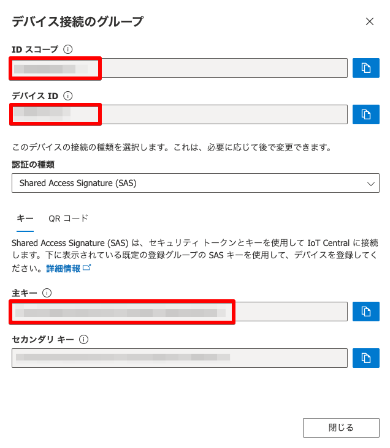

# azure-iot-central-esp32-trial.ino

## Preparing

### `iot_configs.h`

```bash
cp iot_configs.h.sample iot_configs.h
```

Update below properties.

- LAN/Network
  - `IOT_CONFIG_WIFI_SSID`
  - `IOT_CONFIG_WIFI_PASSWORD`
- IoT Central
  - `DPS_ID_SCOPE`
  - `IOT_CONFIG_DEVICE_ID`
  - `IOT_CONFIG_DEVICE_KEY`
  - 

